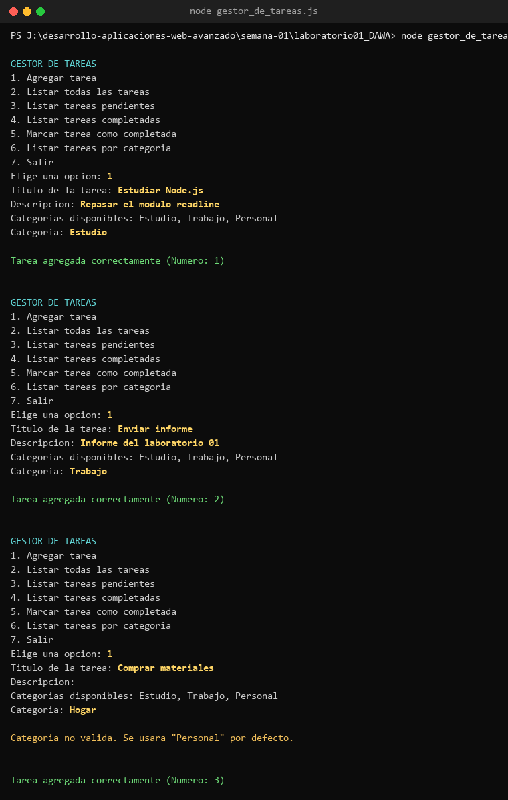
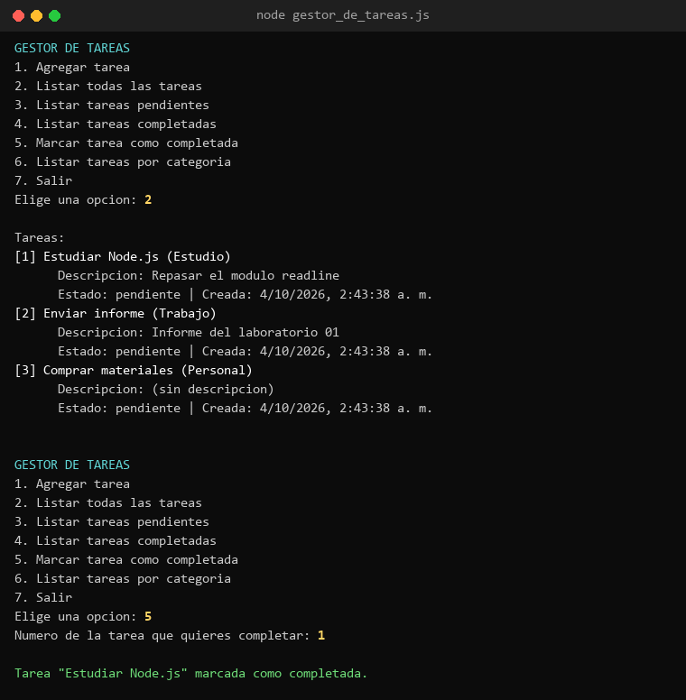
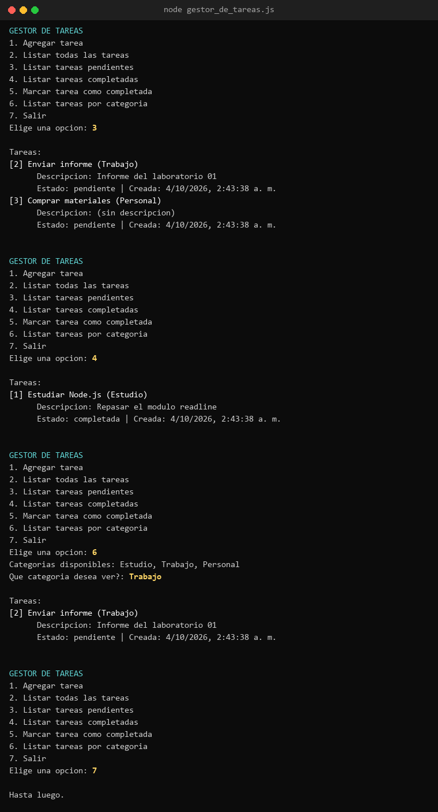

<div align="center">

# Semana 01 — Introducción a Node.js
**Laboratorio 01 · Gestor de tareas por consola**

[Volver al inicio](../README.md)

</div>

---

## Capturas
<table><tr>
<td align="center" valign="top"><br><sub>Agregar tareas (categoría no válida → Personal)</sub></td>
<td align="center" valign="top"><br><sub>Listar todas y marcar una como completada</sub></td>
<td align="center" valign="top"><br><sub>Filtrar por estado y categoría, y salir</sub></td>
</tr></table>

## Contenido
| Archivo | Tipo | Descripción |
|---|---|---|
| [`laboratorio01_DAWA/gestor_de_tareas.js`](laboratorio01_DAWA/gestor_de_tareas.js) | Laboratorio | Menú en la terminal que guarda las tareas en memoria |

## Qué hace
Un programa de Node.js que muestra un menú en la terminal y lee lo que escribe el usuario con el módulo `readline`.

| Opción | Acción |
|---|---|
| 1 | Agregar tarea (título, descripción y categoría) |
| 2 | Listar todas las tareas |
| 3 | Listar tareas pendientes |
| 4 | Listar tareas completadas |
| 5 | Marcar una tarea como completada por su número |
| 6 | Listar tareas por categoría (`Estudio`, `Trabajo` o `Personal`) |
| 7 | Salir |

- Cada tarea es un objeto con `id`, `titulo`, `descripcion`, `categoria`, `estado` y `fechaCreacion`.
- Si la categoría no es válida, se usa `Personal` por defecto.
- Las preguntas de `rl.question` usan **callbacks**, por eso van anidadas.
- Los datos viven en un arreglo: se pierden al cerrar el programa.

## Cómo ejecutarlo
```bash
cd semana-01/laboratorio01_DAWA
node gestor_de_tareas.js
```
