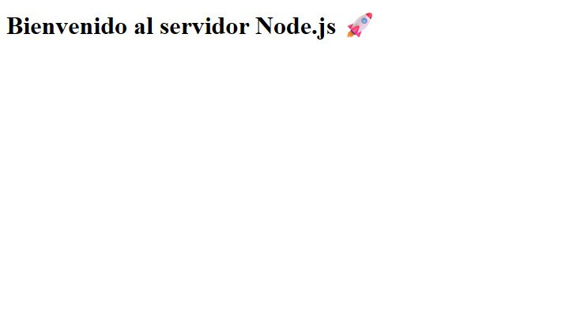
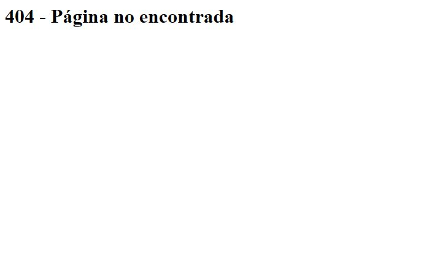
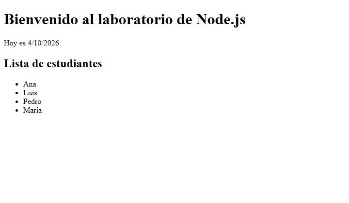
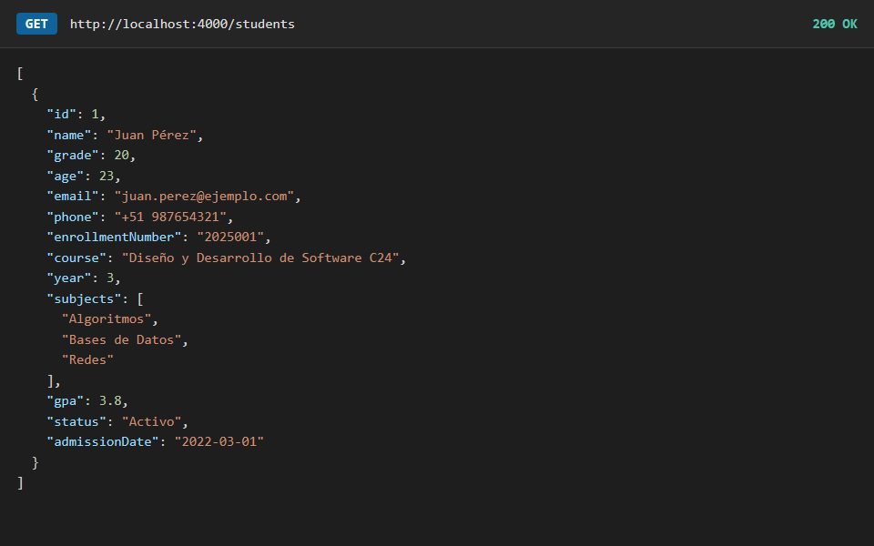
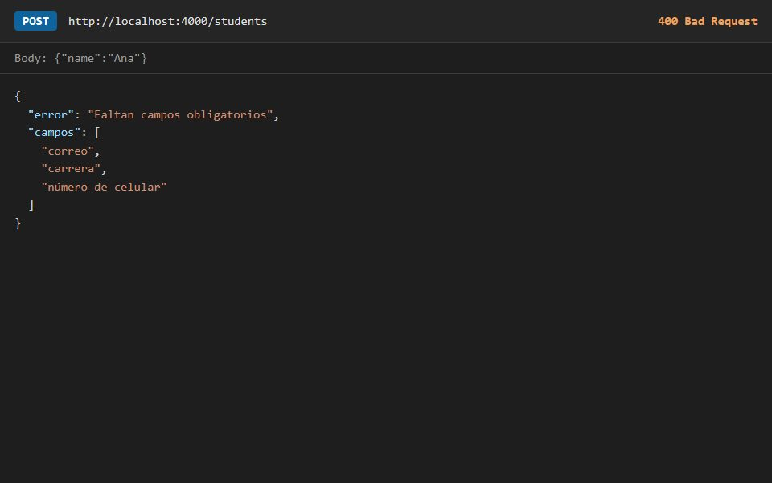

<div align="center">

# Semana 02 — Servidor web con Node.js
**Laboratorio 02 · Módulo `http`, vistas con Handlebars y API con patrón repositorio**

[Volver al inicio](../README.md)

</div>

---

## Capturas
**Ejercicio 01 · Servidor con el módulo `http`**
<table><tr>
<td align="center"><br><sub>Inicio</sub></td>
<td align="center"><br><sub>/services</sub></td>
<td align="center"><br><sub>Ruta inexistente: 404</sub></td>
</tr></table>

**Ejercicio 02 · Vistas con Handlebars**
<table><tr>
<td align="center"><br><sub>Inicio con datos del servidor</sub></td>
<td align="center"><br><sub>/students: se resaltan las notas mayores a 15</sub></td>
</tr></table>

**Ejercicio 03 · API de estudiantes**
<table><tr>
<td align="center"><br><sub>GET /students</sub></td>
<td align="center"><br><sub>POST /students sin todos los campos: 400</sub></td>
</tr></table>

## Contenido
| Proyecto | Tipo | Descripción |
|---|---|---|
| [`ejercicio01`](ejercicio01) | Laboratorio | Servidor con `http` y rutas decididas según `req.url` (puerto 3000) |
| [`ejercicio02`](ejercicio02) | Laboratorio | El HTML sale de plantillas `.hbs` compiladas con Handlebars (puerto 3000) |
| [`ejercicio03`](ejercicio03) | Laboratorio | API JSON de estudiantes con los datos en un repositorio (puerto 4000) |

### Ejercicio 01: rutas
| Ruta | Respuesta |
|---|---|
| `/` | Bienvenida |
| `/about` | Acerca de nosotros |
| `/contact` | Contacto |
| `/services` | Lista de servicios |
| `/error` | Error 500 a propósito |
| otra | 404 |

### Ejercicio 03: endpoints
| Método | Ruta | Acción |
|---|---|---|
| GET | `/students` | Listar todos |
| GET | `/students/:id` | Obtener uno (404 si no existe) |
| POST | `/students` | Crear, validando los campos obligatorios (400 si falta alguno) |
| PUT | `/students/:id` | Actualizar |
| DELETE | `/students/:id` | Eliminar |
| POST | `/ListByStatus` | Listar por estado |
| POST | `/ListByGrade` | Listar por promedio mínimo |

El servidor no toca los datos directamente: llama a `studentsRepository.js` (`getAll`, `getById`, `create`, `update`, `remove`, `getByStatus`, `getByGrade`).

## Cómo ejecutarlo
```bash
cd semana-02/ejercicio01   # o ejercicio02 / ejercicio03
npm install                # solo ejercicio02 (handlebars)
node server.js             # ejercicio03: node main.js
```
