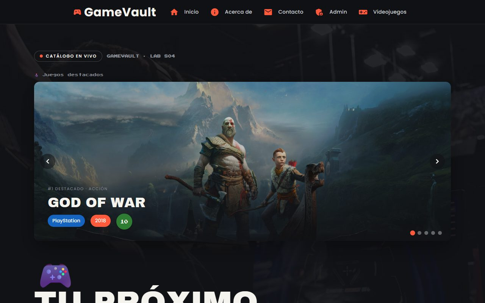
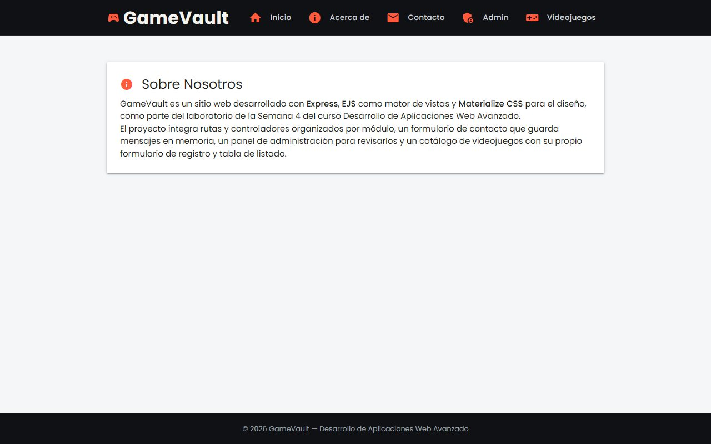
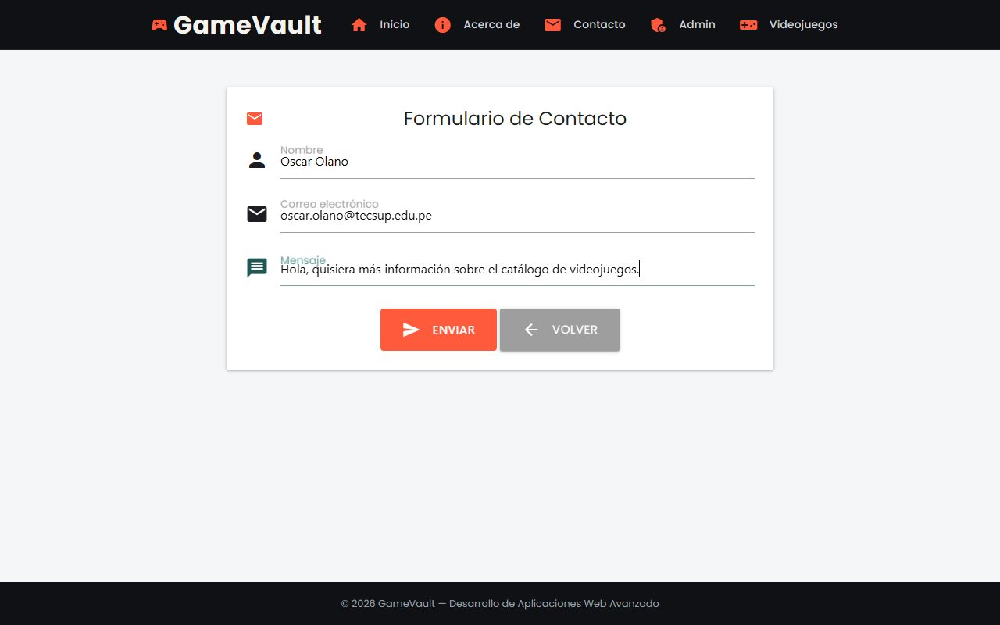
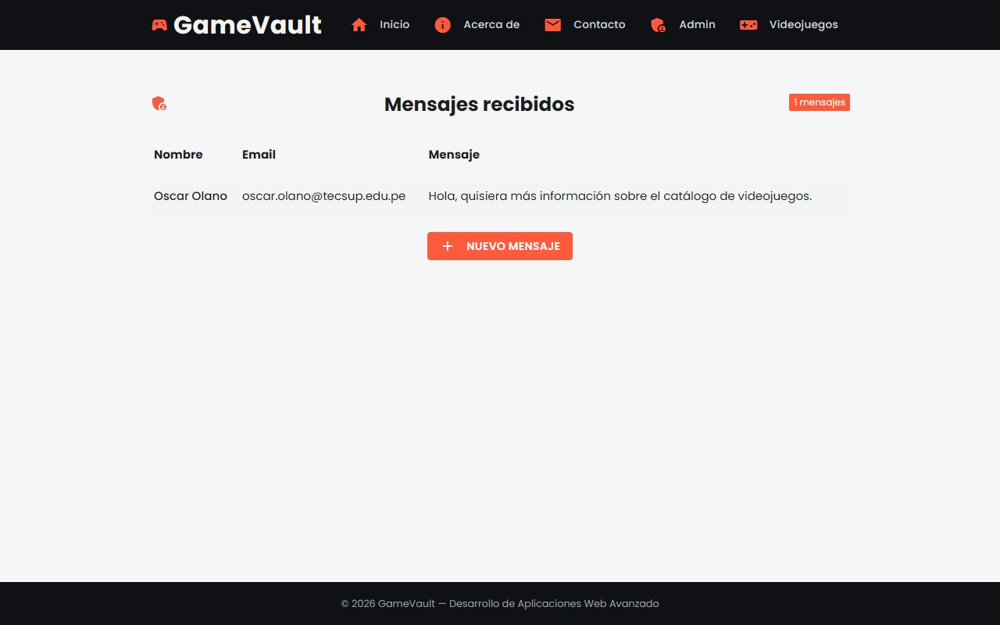
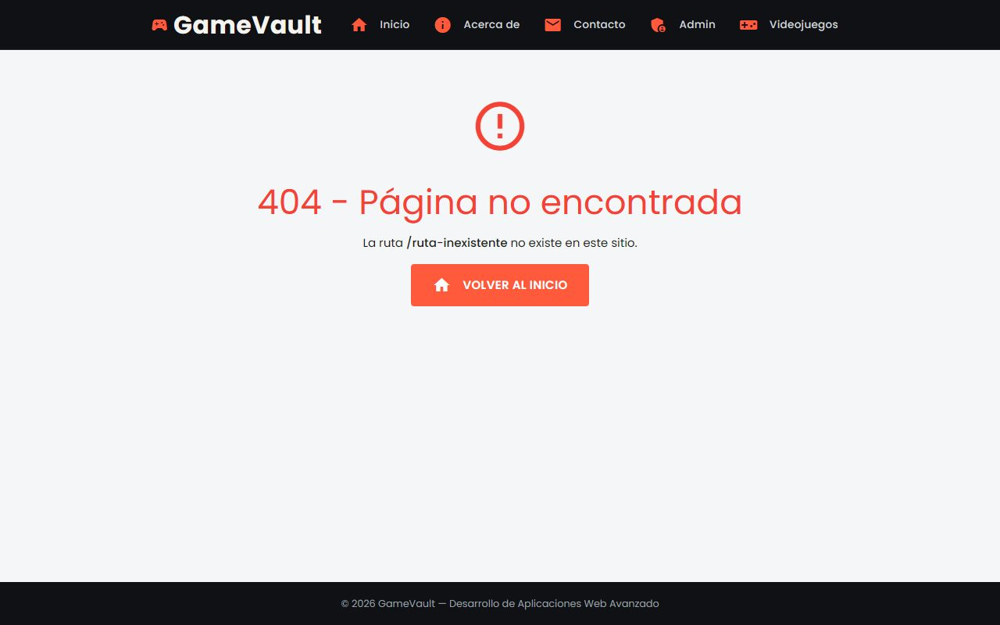
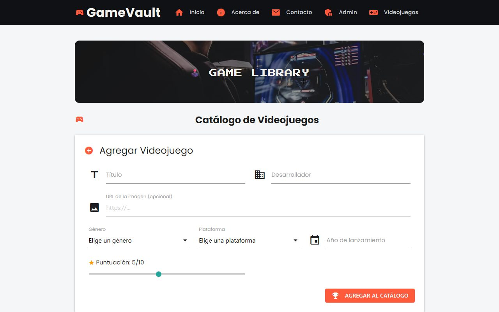
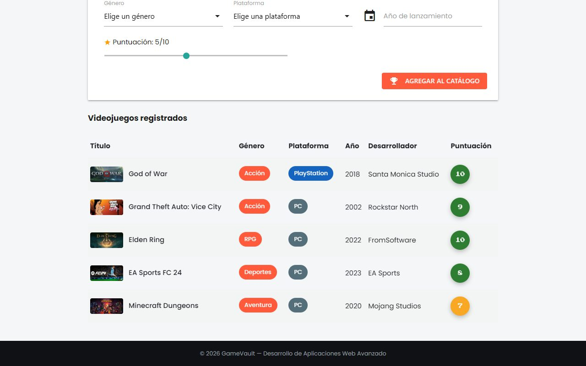

<div align="center">

# Semana 04 — Sitio web con Express
**Laboratorio 04 · Rutas, controladores y vistas EJS con Materialize**

[Volver al inicio](../README.md)

</div>

---

## Capturas
**Laboratorio · Sitio con Express y EJS**
<table><tr>
<td align="center"><br><sub>Inicio con carrusel de juegos destacados</sub></td>
<td align="center"><br><sub>Acerca de</sub></td>
</tr></table>

**Tarea · Contacto, admin y 404**
<table><tr>
<td align="center"><br><sub>Formulario de contacto (POST /contact)</sub></td>
<td align="center"><br><sub>/admin: mensajes recibidos</sub></td>
</tr><tr>
<td align="center"><br><sub>Error 404 personalizado</sub></td>
<td></td>
</tr></table>

**Tarea · Vista a libre criterio: catálogo de videojuegos**
<table><tr>
<td align="center"><br><sub>Formulario para registrar un videojuego</sub></td>
<td align="center"><br><sub>Tabla con los videojuegos registrados</sub></td>
</tr></table>

## Contenido
| Proyecto | Tipo | Descripción |
|---|---|---|
| [`mi-sitio-express`](mi-sitio-express) | Laboratorio | Express + EJS: `app.js`, rutas, controladores, vistas y `public/` |
| [`mi-sitio-express`](mi-sitio-express) | Tarea | Contacto, admin, 404 y el controlador nuevo `gamesController` |

## Estructura
```
mi-sitio-express/
├── app.js            # EJS, archivos estáticos, rutas y el 404 al final
├── routes/           # mainRoutes.js y gamesRoutes.js
├── controllers/      # mainController.js y gamesController.js
├── views/            # home, about, contact, admin, games, notFound y partials
└── public/           # styles.css
```

## Rutas
| Método | Ruta | Controlador | Qué hace |
|---|---|---|---|
| GET | `/` | `mainController.home` | Inicio con carrusel de juegos destacados |
| GET | `/about` | `mainController.about` | Acerca de |
| GET | `/contact` | `mainController.contact` | Formulario de contacto |
| POST | `/contact` | `mainController.saveContact` | Guarda el mensaje en memoria y redirige a `/admin` |
| GET | `/admin` | `mainController.admin` | Lista los mensajes recibidos |
| GET | `/games` | `gamesController.index` | Formulario y tabla de videojuegos |
| POST | `/games` | `gamesController.create` | Valida y registra un videojuego |
| — | cualquier otra | middleware final | Página 404 |

- El formulario de contacto se lee con `express.urlencoded({ extended: true })`.
- El 404 es un middleware que va **después** de todas las rutas.
- Videojuegos: título, género, plataforma, año, desarrollador, calificación e imagen, guardados en memoria y validados en el navegador y en el servidor.

## Conclusiones
1. Aprendí a separar un sitio en rutas, controladores y vistas, lo que hace el código más ordenado y fácil de mantener.
2. Entendí cómo EJS genera HTML a partir de una plantilla y los datos que envía el servidor.
3. Comprendí que el orden de los middlewares importa: el 404 tiene que ir al final.
4. Practiqué el envío de formularios con POST y cómo Express lee sus datos.
5. Vi que validar en el navegador no basta: el servidor también debe revisar los datos.

## Cómo ejecutarlo
```bash
cd semana-04/mi-sitio-express
npm install
node app.js
```
Abrir http://localhost:3000
