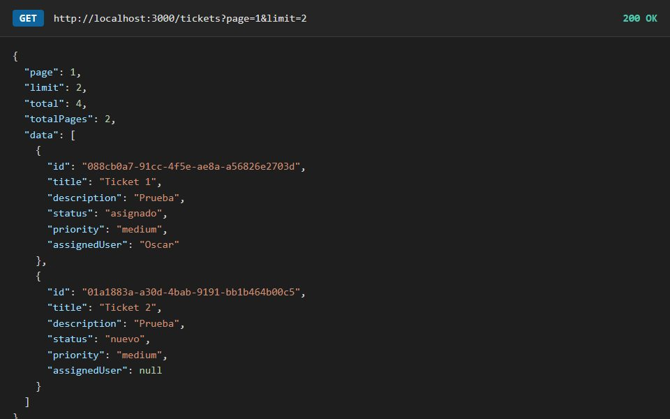
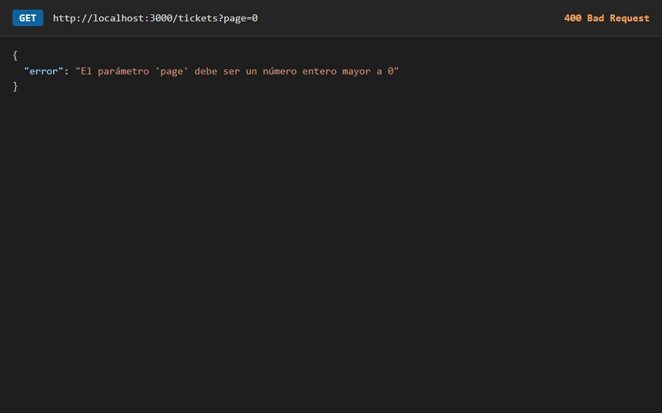
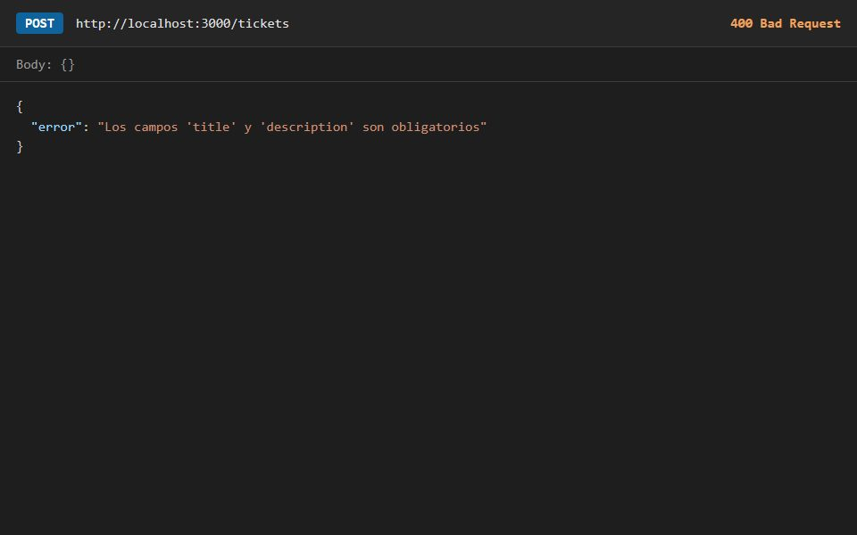
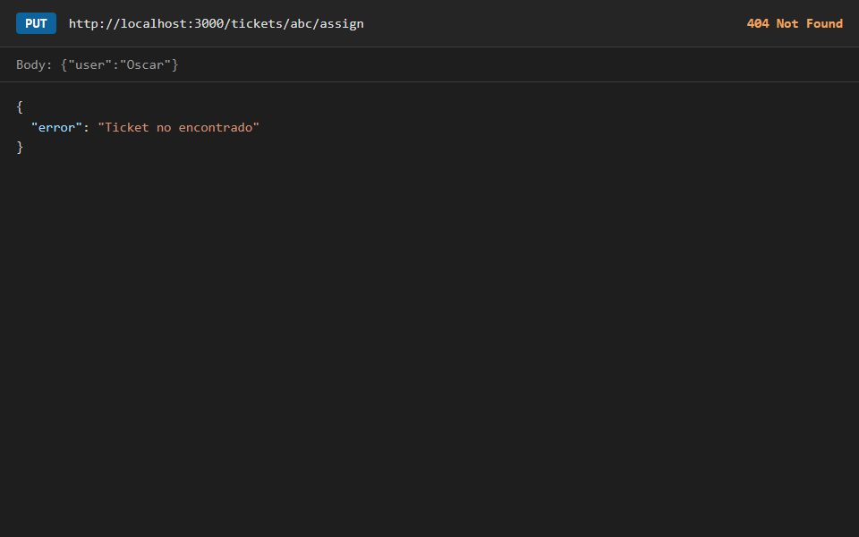
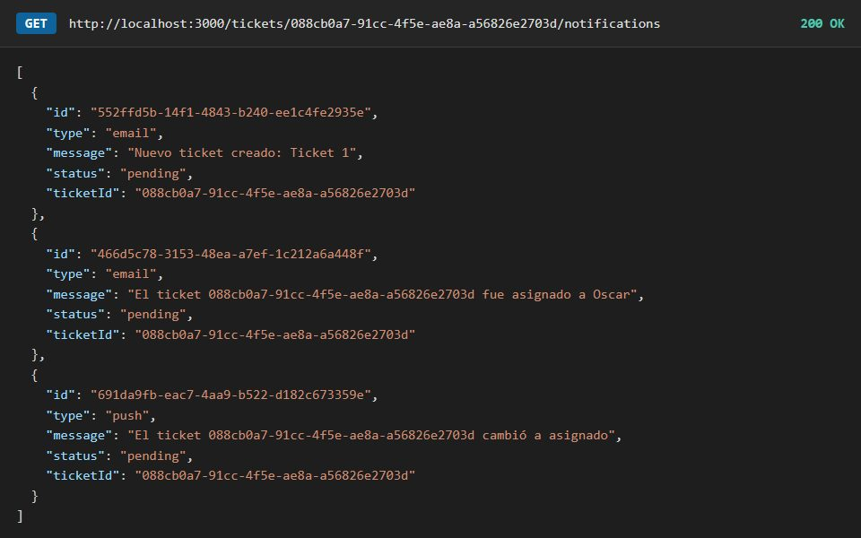

<div align="center">

# Semana 05 — APIs RESTful con Express.js
**Laboratorio 05 · Tickets y notificaciones en capas, con manejo de errores, paginación y envío de correos**

[Volver al inicio](../README.md)

</div>

---

## Capturas
**Tarea · Paginación**
<table><tr>
<td align="center"><br><sub>GET /tickets?page=1&limit=2</sub></td>
<td align="center"><br><sub>Parámetro inválido: 400</sub></td>
</tr></table>

**Tarea · Manejo de errores con `errorHandler`**
<table><tr>
<td align="center"><br><sub>POST /tickets sin datos: 400</sub></td>
<td align="center"><br><sub>Ticket inexistente: 404</sub></td>
</tr></table>

**Tarea · Notificaciones de un ticket**
<table><tr>
<td align="center"><br><sub>GET /tickets/:id/notifications</sub></td>
<td></td>
</tr></table>

## Contenido
| Proyecto | Tipo | Descripción |
|---|---|---|
| [`api-restful`](api-restful) | Laboratorio | API de tickets y notificaciones con datos en `database/db.json` y envío de correos con Nodemailer |
| [`api-restful`](api-restful) | Tarea | `errorHandler` global, paginación y notificaciones por ticket |

## Arquitectura en capas
```
Ruta → Controlador → Servicio → Repositorio → db.json
```
| Capa | Archivos | Responsabilidad |
|---|---|---|
| Rutas | `routes/*.routes.js` | Qué URL y método responde |
| Controladores | `controllers/*Controller.js` | Reciben la petición y responden con el código HTTP |
| Servicios | `services/*Service.js` | Lógica de negocio y notificaciones |
| Repositorios | `repositories/*Repository.js` | Leen y escriben el archivo (heredan de `BaseRepository`) |
| Errores | `middlewares/errorHandler.js` y `utils/HttpError.js` | Respuesta única `{ "error": "..." }` con su código |

## Endpoints
| Método | Ruta | Acción |
|---|---|---|
| GET | `/tickets?page=1&limit=5` | Listar tickets paginados (`page`, `limit`, `total`, `totalPages`, `data`) |
| POST | `/tickets` | Crear (`title`, `description`) |
| PUT | `/tickets/:id/assign` | Asignar a un usuario |
| PUT | `/tickets/:id/status` | Cambiar estado |
| DELETE | `/tickets/:id` | Eliminar |
| GET | `/tickets/:id/notifications` | Historial de notificaciones de un ticket |
| GET | `/notifications` | Historial completo |

Cada acción sobre un ticket genera una notificación: las de tipo `email` se envían de verdad con Nodemailer y las de tipo `push` solo se guardan.

## Conclusiones
1. Aprendí a construir una API RESTful con Express en la que cada verbo HTTP indica una acción.
2. Organizar el código en rutas, controladores, servicios y repositorios hace que cada parte tenga una sola responsabilidad.
3. Un manejador de errores global evita repetir `try/catch` y unifica el formato de las respuestas.
4. La paginación reduce el tamaño de las respuestas y prepara la API para cuando haya muchos registros.
5. Las credenciales del correo van en un `.env`, que nunca se sube al repositorio.

## Cómo ejecutarlo
```bash
cd semana-05/api-restful
npm install
cp .env.example .env    # completar los datos del correo
npm run dev
```
API en http://localhost:3000. Los `POST` y `PUT` se prueban en Postman con Body → raw → JSON.
