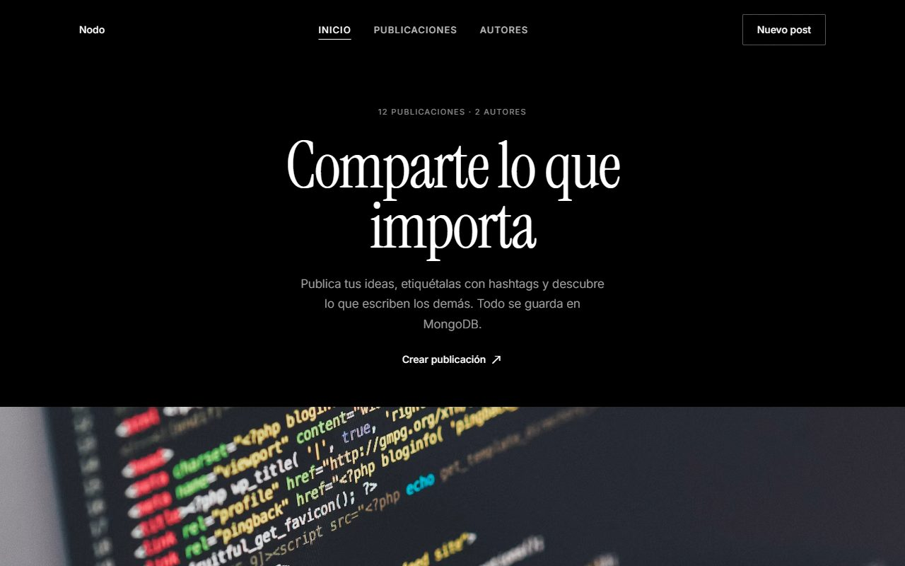
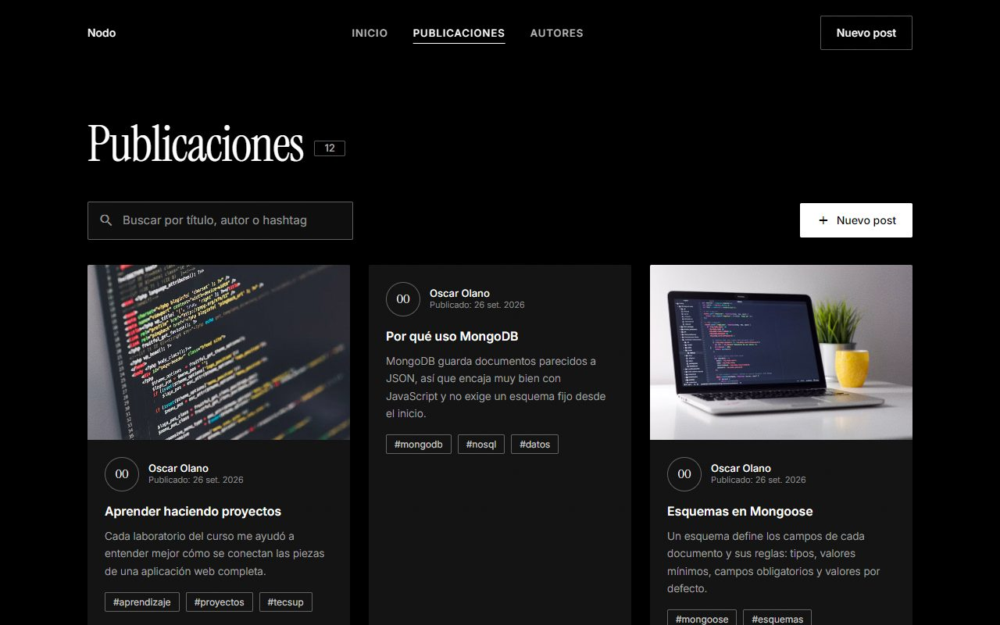
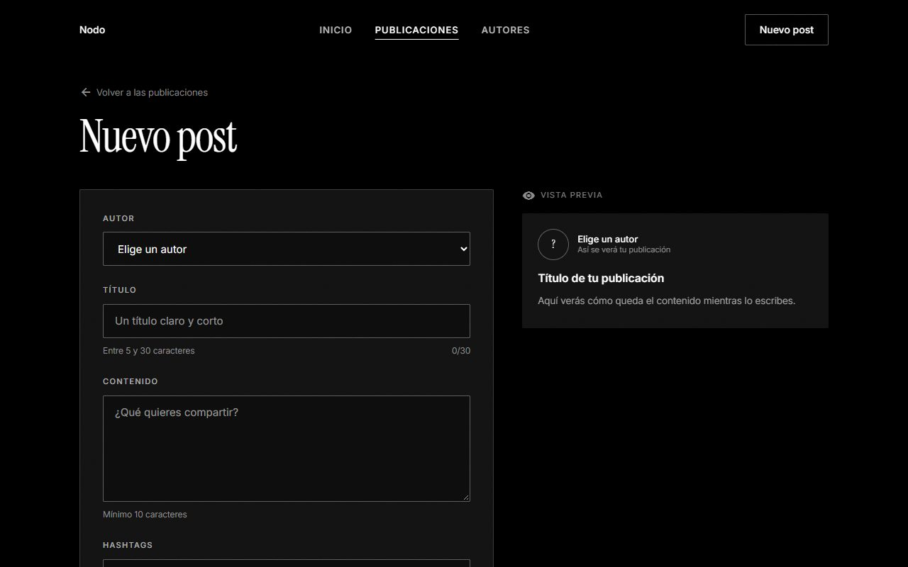
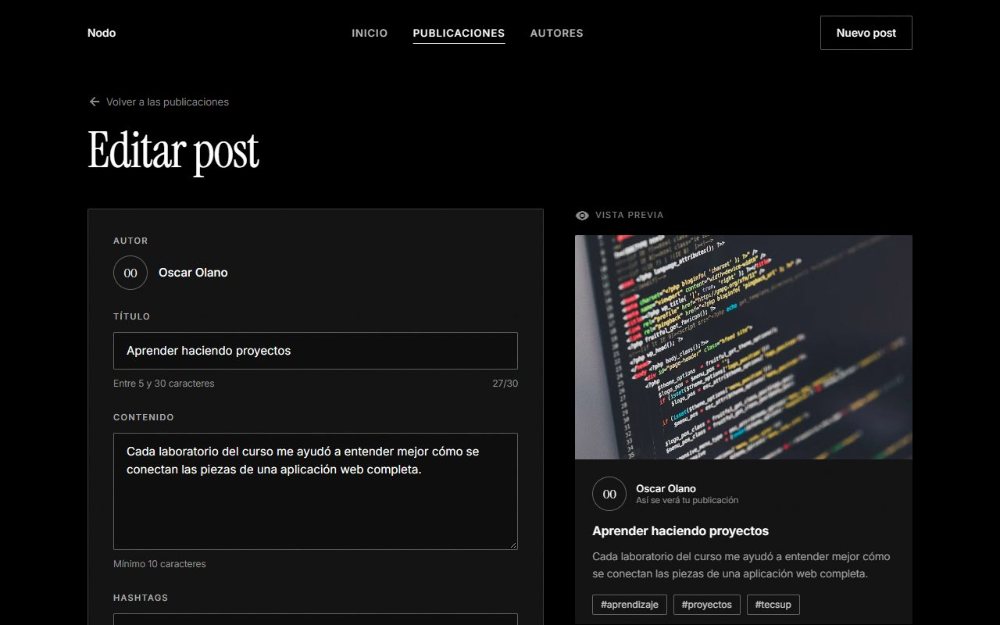
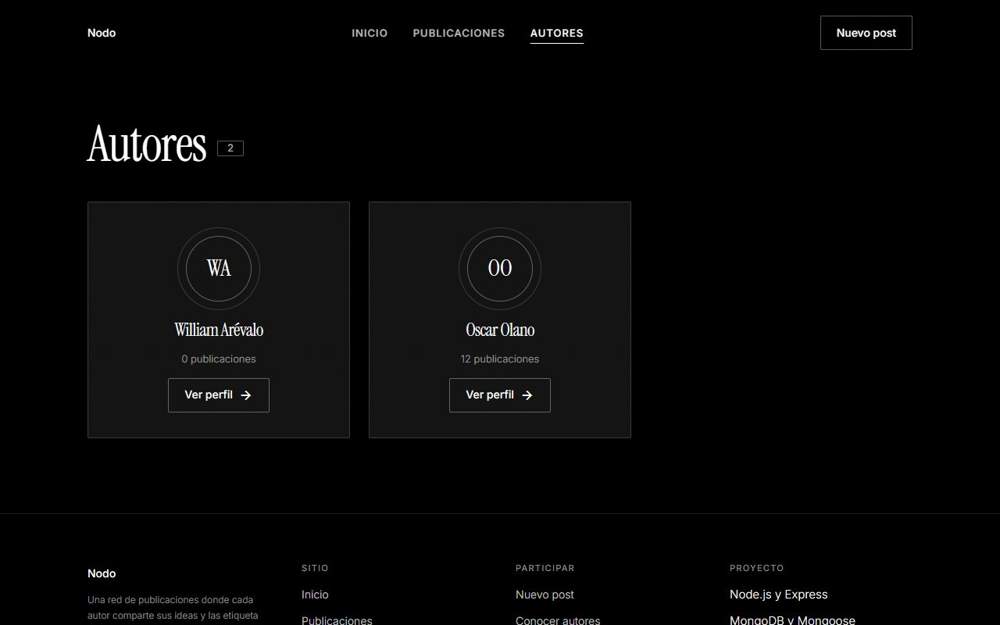
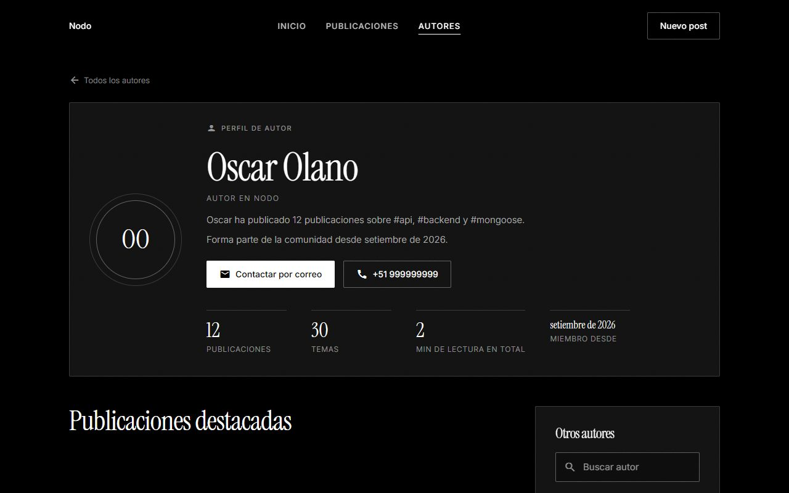

<div align="center">

# Semana 06 — Bases de datos NoSQL con MongoDB
**Laboratorio 06 · Node.js con MongoDB y Mongoose · aplicación web de publicaciones**

[Volver al inicio](../README.md)

</div>

---

## Capturas
**Laboratorio · Aplicación web con Express, EJS y MongoDB**
<table><tr>
<td align="center"><br><sub>Inicio</sub></td>
<td align="center"><br><sub>Lista de publicaciones (populate del autor)</sub></td>
</tr></table>

**Tarea · CRUD de posts**
<table><tr>
<td align="center"><br><sub>Formulario para crear un post</sub></td>
<td align="center"><br><sub>Editar un post con vista previa</sub></td>
</tr></table>

**Tarea · Perfil de autor (agregado)**
<table><tr>
<td align="center"><br><sub>Autores</sub></td>
<td align="center"><br><sub>Perfil de autor con estadísticas</sub></td>
</tr></table>

## Contenido
| Proyecto | Tipo | Descripción |
|---|---|---|
| [`mongo-node`](mongo-node) | Laboratorio | Conexión con Mongoose, modelos `User` y `Post` con relación, y la web con Express y EJS |
| [`mongo-node`](mongo-node) | Tarea | Restricciones en los esquemas, CRUD de posts y perfil de autor |

## Modelos
**User**
| Campo | Restricciones |
|---|---|
| `name`, `lastName` | Texto obligatorio |
| `email` | Único |
| `age` | Número, mínimo 18, obligatorio |
| `phoneNumber` | Texto |
| `password` | Mínimo 8 caracteres, obligatorio (nunca se envía a las vistas) |
| `createdAt` | Fecha actual por defecto |

**Post**
| Campo | Restricciones |
|---|---|
| `title` | De 5 a 30 caracteres, obligatorio |
| `content` | Mínimo 10 caracteres, obligatorio |
| `hashtags` | Lista de textos |
| `imageUrl` | Debe empezar con `http://` o `https://` |
| `user` | Referencia a `User` (se completa con `populate`) |
| `createdAt`, `updatedAt` | Fechas de creación y edición |

## Rutas
| Método | Ruta | Acción |
|---|---|---|
| GET | `/` | Inicio |
| GET | `/posts` | Lista de publicaciones |
| GET | `/posts/new` | Formulario para crear |
| POST | `/posts` | Crear |
| GET | `/posts/:id/edit` | Formulario para editar |
| POST | `/posts/:id/update` | Guardar cambios (con `runValidators`) |
| POST | `/posts/:id/delete` | Eliminar |
| GET | `/authors` | Lista de autores |
| GET | `/authors/:id` | Perfil de autor |

Los formularios HTML solo permiten GET y POST, por eso editar y eliminar usan `POST` con rutas propias.

## Conclusiones
1. Aprendí a conectar Node.js con MongoDB usando Mongoose y a organizar el proyecto en modelos, repositorios, servicios y controladores.
2. Entendí que MongoDB guarda documentos en colecciones sin un esquema fijo, y que Mongoose permite definir reglas para los datos.
3. Practiqué las restricciones en los esquemas (obligatorios, mínimos, máximos y valores por defecto) para que solo se guarden datos válidos.
4. Comprendí las relaciones entre colecciones con referencias y el uso de `populate` para traer los datos completos del autor de cada post.
5. Implementé el CRUD de posts en una aplicación web con Express y EJS, y comprobé los datos guardados con `mongosh`.

## Cómo ejecutarlo
```bash
net start MongoDB          # en una terminal de administrador
cd semana-06/mongo-node
npm install
cp .env.example .env
npm run seed               # crea un usuario de ejemplo
npm run dev
```
Abrir http://localhost:3001
