<div align="center">

# Semana 07 — Seguridad en aplicaciones con JWT
**Laboratorio 07 · API con Express y MongoDB, contraseñas con bcrypt, JWT y control de acceso por roles**

[Volver al inicio](../README.md)

</div>

---

## Demostración
Recorrido completo como **usuario** y como **administrador**:

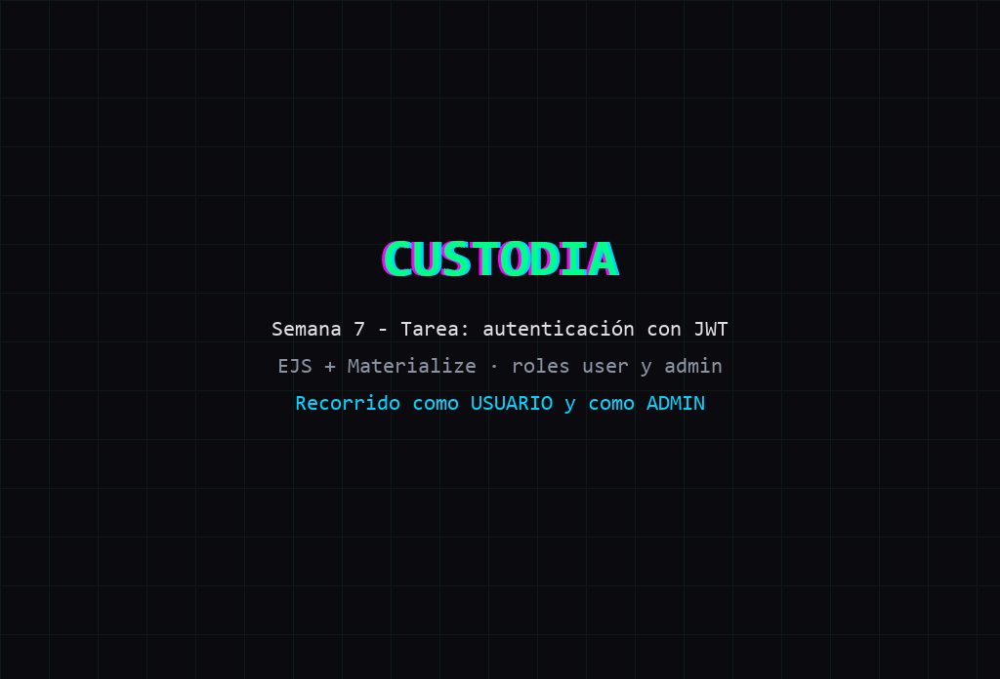

## Capturas
**Tarea · Registro e inicio de sesión**
<table><tr>
<td align="center">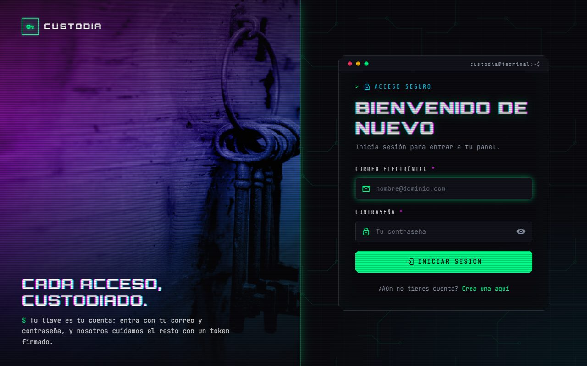<br><sub>SignIn</sub></td>
<td align="center">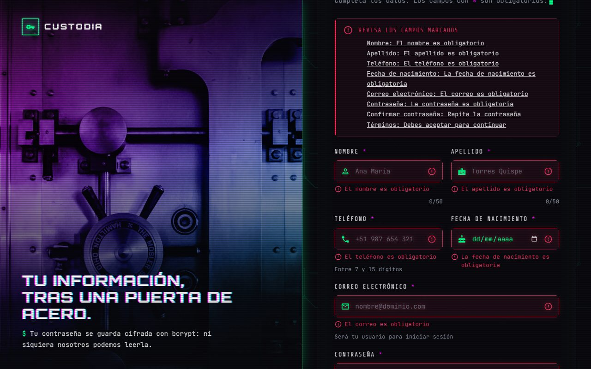<br><sub>SignUp: resumen de errores al enviar vacío</sub></td>
</tr><tr>
<td align="center">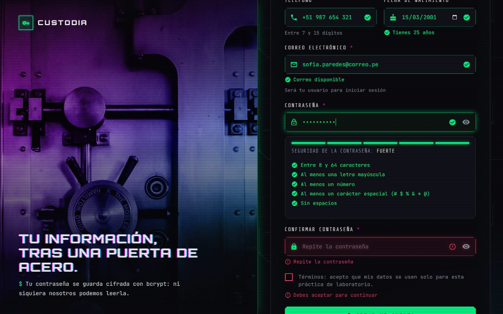<br><sub>Validación en vivo y requisitos de la contraseña</sub></td>
<td align="center">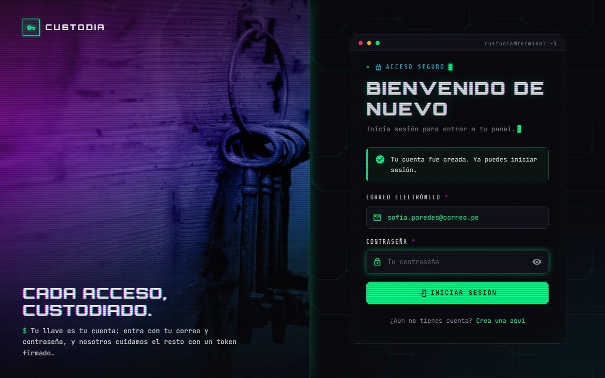<br><sub>Cuenta creada con rol user</sub></td>
</tr></table>

**Tarea · Usuario**
<table><tr>
<td align="center">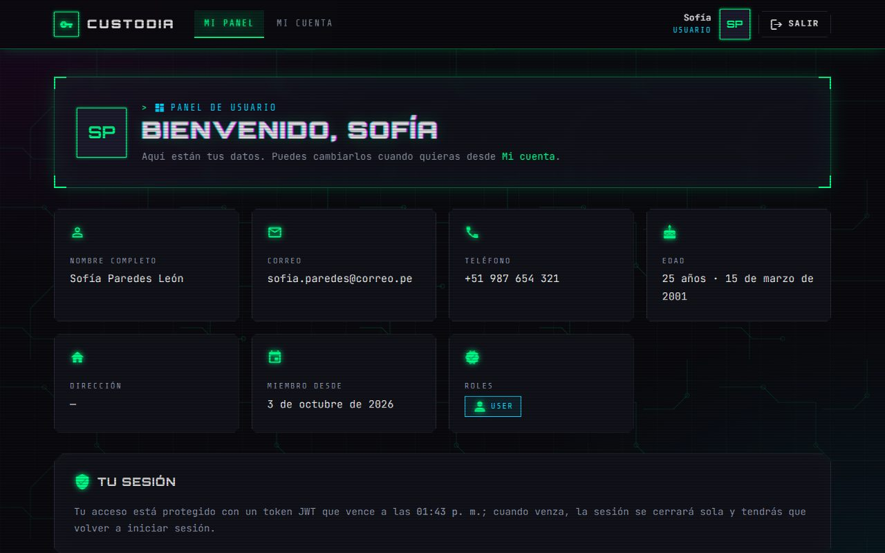<br><sub>Dashboard: "Bienvenido" y sus datos</sub></td>
<td align="center">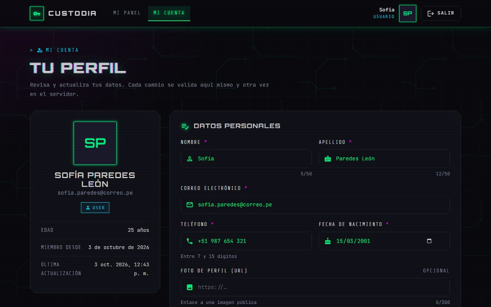<br><sub>Perfil: ver y editar datos</sub></td>
</tr><tr>
<td align="center">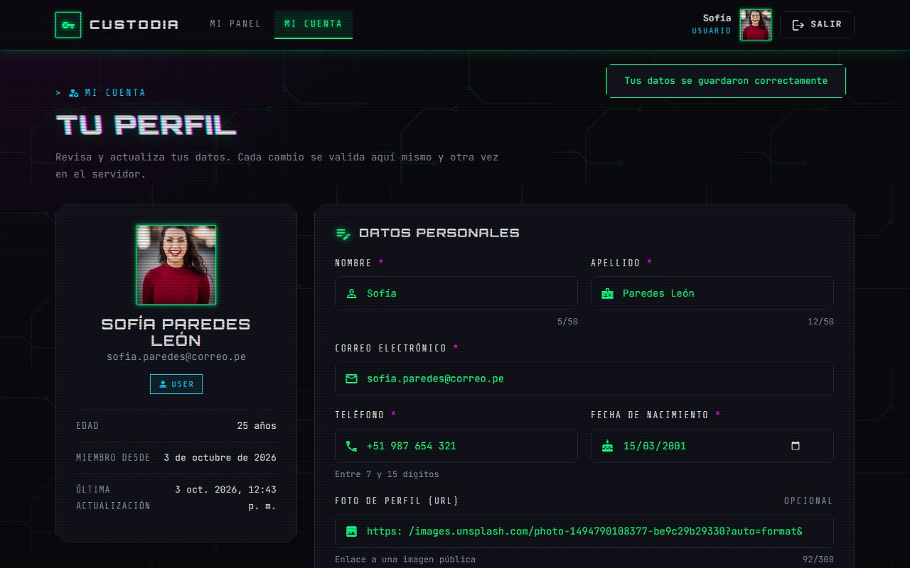<br><sub>Datos guardados con foto de perfil</sub></td>
<td align="center">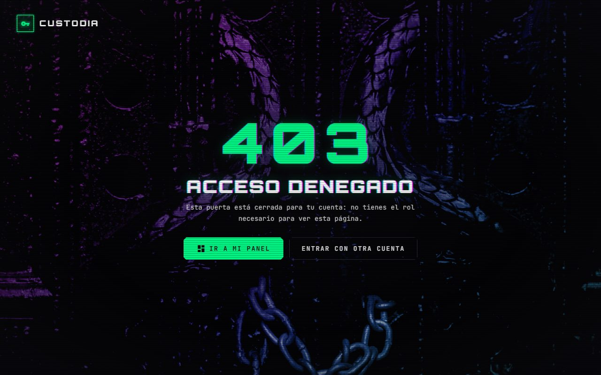<br><sub>Un usuario que entra a /admin: 403</sub></td>
</tr></table>

**Tarea · Administrador**
<table><tr>
<td align="center">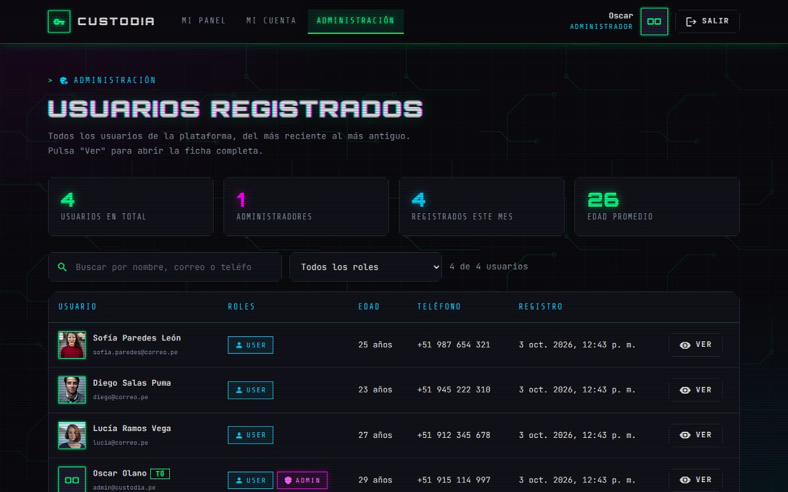<br><sub>Dashboard admin: usuarios registrados</sub></td>
<td align="center">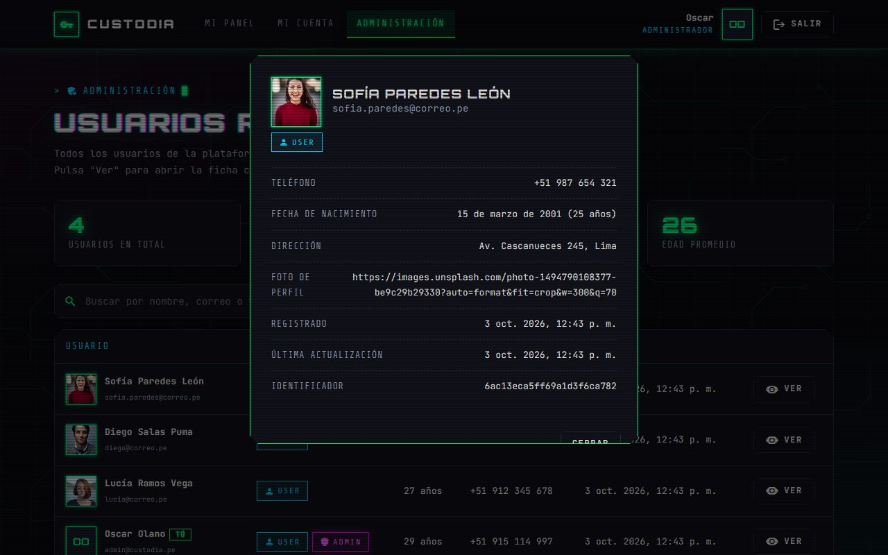<br><sub>Botón "Ver": ficha del usuario</sub></td>
</tr><tr>
<td align="center">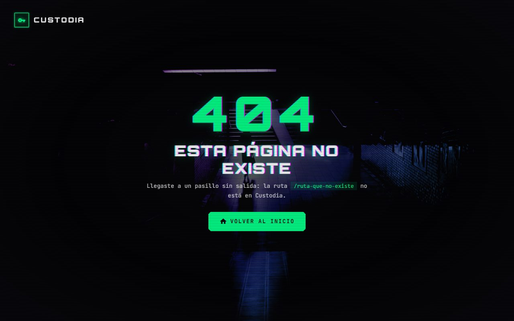<br><sub>Página 404</sub></td>
<td></td>
</tr></table>

## Contenido
| Proyecto | Tipo | Descripción |
|---|---|---|
| [`express-mongo-auth`](express-mongo-auth) | Laboratorio | API con registro, inicio de sesión con JWT, contraseñas con bcrypt y roles `user` y `admin` |
| [`express-mongo-auth`](express-mongo-auth) | Tarea | Campos nuevos del usuario, admin inicial con `seedUsers`, vistas EJS + Materialize y validación en cliente y servidor |

## Endpoints
| Método | Ruta | Acceso | Acción |
|---|---|---|---|
| POST | `/api/auth/signUp` | Público | Registro (siempre con rol `user`) |
| POST | `/api/auth/signIn` | Público | Inicio de sesión, devuelve el JWT |
| POST | `/api/auth/email-available` | Público | Comprueba si el correo está libre |
| GET | `/api/users/me` | Con token | Datos del usuario |
| PUT | `/api/users/me` | Con token | Editar el perfil |
| PUT | `/api/users/me/password` | Con token | Cambiar la contraseña |
| GET | `/api/users` | Admin | Lista de usuarios |
| GET | `/api/users/:id` | Admin | Ficha de un usuario |

Sin token la API responde **401**; con token pero sin el rol necesario, **403**.

## Páginas
| Ruta | Página | Acceso |
|---|---|---|
| `/signIn` · `/signUp` | Inicio de sesión y registro | Público |
| `/dashboard` | Dashboard del usuario | user o admin |
| `/profile` | Perfil | Con sesión |
| `/admin` | Dashboard del administrador | admin |
| `/403` · cualquier otra | Acceso denegado y 404 | — |

El token se guarda en `sessionStorage`. Si vence, la sesión se cierra sola y vuelve a `/signIn`.

## Validaciones
- **Cliente:** reglas HTML5, validación mientras se escribe, correo disponible en vivo, filtro de caracteres en el teléfono, requisitos de la contraseña con medidor de seguridad, confirmación de contraseña y resumen de errores.
- **Servidor:** las mismas reglas (compartidas en `src/shared/rules.js`), revisión de tipos contra inyección NoSQL, solo los campos permitidos, correos únicos y límite de 10 KB por petición.
- **Base de datos:** el esquema de Mongoose es la última capa.

## Conclusiones
1. Aprendí cómo funciona la autenticación con JWT: el servidor entrega un token firmado y ese token se envía en cada petición para saber quién es el usuario y qué rol tiene.
2. Entendí por qué las contraseñas se guardan cifradas con bcrypt: en la base de datos solo queda un hash, no la contraseña real.
3. Vi la diferencia entre ocultar una página en el navegador y protegerla en el servidor: la protección real está en la API, que responde 401 o 403.
4. Aprendí que toda validación debe hacerse en el cliente y también en el servidor.
5. Con EJS y Materialize separé las vistas, las rutas y las capas de la aplicación, con paneles distintos según el rol.

## Cómo ejecutarlo
```bash
net start MongoDB          # en una terminal de administrador
cd semana-07/express-mongo-auth
npm install
cp .env.example .env       # completar JWT_SECRET, ADMIN_EMAIL y ADMIN_PASSWORD
npm run dev
```
Abrir http://localhost:3000. Al arrancar se crea el administrador con los datos del `.env`.
