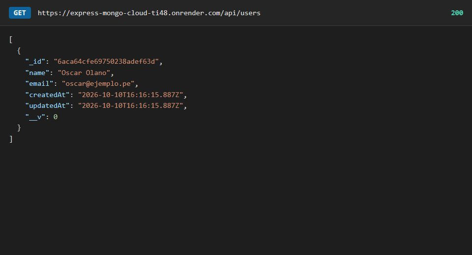
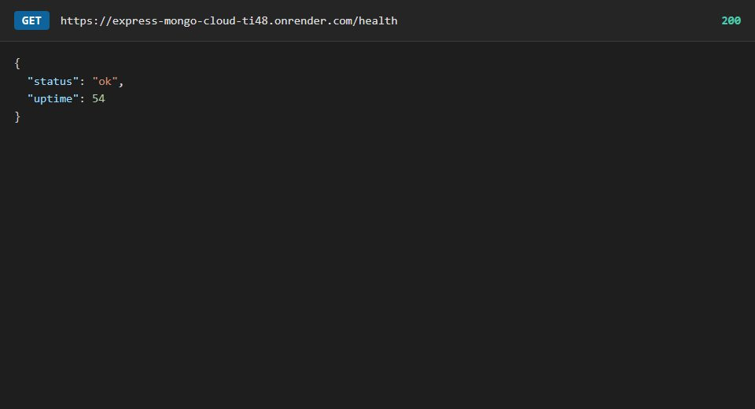
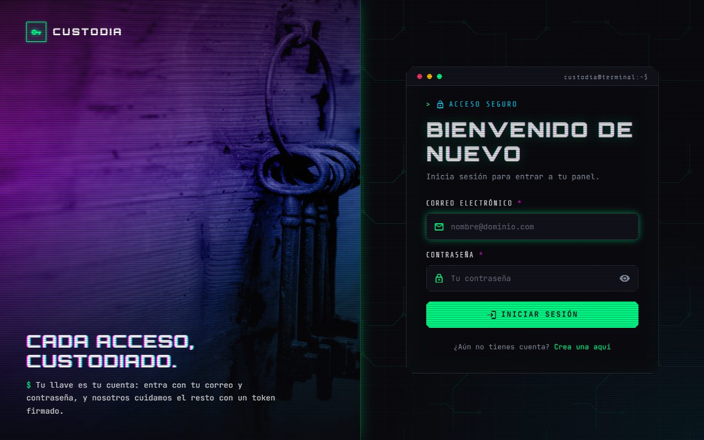
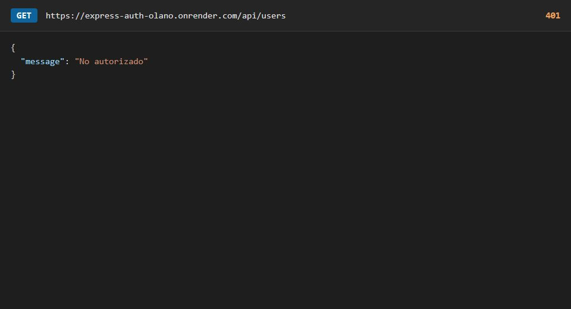
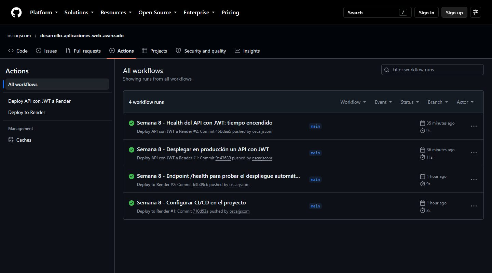

<div align="center">

# Semana 08 — Despliegue de aplicaciones con JWT
**Laboratorio 08 · MongoDB Atlas, Render e integración continua con GitHub Actions**

[Volver al inicio](../README.md)

</div>

---

## Despliegues en la nube
| API | URL | Base de datos |
|---|---|---|
| Laboratorio: `express-mongo-cloud` | https://express-mongo-cloud-ti48.onrender.com | `my_cloud_database` en MongoDB Atlas |
| Tarea: API con JWT (semana 7) | https://express-auth-olano.onrender.com | `auth_db_cloud` en MongoDB Atlas |

El plan gratuito de Render "duerme" el servicio si no se usa: la primera petición puede tardar cerca de un minuto.

## Capturas
**Laboratorio · API de usuarios en la nube**
<table><tr>
<td align="center"><br><sub>GET /api/users en Render</sub></td>
<td align="center"><br><sub>GET /health: el servicio responde</sub></td>
</tr></table>

**Tarea · API con JWT desplegada**
<table><tr>
<td align="center"><br><sub>SignIn en la nube</sub></td>
<td align="center"><br><sub>GET /api/users sin token: 401</sub></td>
</tr></table>

**Tarea · Integración continua con GitHub Actions**
<table><tr>
<td align="center"><br><sub>Las ejecuciones de los dos workflows, en verde</sub></td>
</tr></table>

## Contenido
| Proyecto | Tipo | Descripción |
|---|---|---|
| [`express-mongo-cloud`](express-mongo-cloud) | Laboratorio | API de usuarios con Express y Mongoose, conectada a MongoDB Atlas y desplegada en Render |
| [`../semana-07/express-mongo-auth`](../semana-07/express-mongo-auth) | Tarea | La API con JWT de la semana 7, desplegada en Render con su propia base en Atlas |
| [`../.github/workflows`](../.github/workflows) | Tarea | Un workflow por API: cada cambio en `main` dispara el despliegue automático |

## Laboratorio: `express-mongo-cloud`
```
express-mongo-cloud/
├── .env.example          # variables que hay que crear (el .env no se sube)
├── package.json
└── src/
    ├── app.js            # Express, CORS, rutas y manejador de errores
    ├── server.js         # conecta a Atlas y luego arranca el servidor
    ├── models/           # User (name, email único)
    ├── repositories/     # acceso a datos con Mongoose
    ├── services/         # validación y reglas
    ├── controllers/      # respuestas HTTP
    ├── routes/           # users.routes.js
    └── utils/            # errores HTTP
```

| Método | Ruta | Acción |
|---|---|---|
| GET | `/` | Mensaje de bienvenida |
| GET | `/health` | Estado del servicio y tiempo encendido |
| GET | `/api/users` | Listar usuarios |
| GET | `/api/users/:id` | Obtener un usuario (404 si no existe) |
| POST | `/api/users` | Crear (`name` y `email`; 400 si faltan o son inválidos, 409 si el correo ya existe) |
| PUT | `/api/users/:id` | Actualizar |
| DELETE | `/api/users/:id` | Eliminar |

El servidor solo arranca si logra conectarse a Atlas.

## Tarea 1: CI/CD con GitHub Actions
Cada API tiene un workflow en `.github/workflows/`:

| Archivo | Se dispara cuando cambia | Secreto de GitHub |
|---|---|---|
| `deploy.yml` | `semana-08/express-mongo-cloud/**` | `RENDER_DEPLOY_HOOK_URL` |
| `deploy-auth.yml` | `semana-07/express-mongo-auth/**` | `RENDER_DEPLOY_HOOK_AUTH_URL` |

Pasos de cada workflow:
1. `actions/checkout` descarga el repositorio.
2. `curl -X POST` llama al **Deploy Hook** de Render, tomado del secreto.
3. Render descarga el último commit, instala las dependencias y reinicia el servicio.

Como el repositorio guarda todas las semanas, el filtro `paths` evita desplegar cuando se cambia otra carpeta.

## Tarea 2: API con JWT en producción
- Servicio de Render con la carpeta raíz `semana-07/express-mongo-auth`, comando de build `npm install` y de arranque `npm start`.
- Base de datos propia en Atlas, `auth_db_cloud`, separada de la del laboratorio.
- Variables de entorno en Render: `PORT`, `MONGODB_URI`, `JWT_SECRET`, `JWT_EXPIRES_IN`, `BCRYPT_SALT_ROUNDS`, `ADMIN_EMAIL` y `ADMIN_PASSWORD`. Sus valores no están en el repositorio.
- Al arrancar se crean los roles y el administrador inicial.
- Comprobado en la nube: registro, inicio de sesión, respuestas 401 y 403, y panel del administrador.

## Cómo ejecutarlo en local
```bash
cd semana-08/express-mongo-cloud
npm install
cp .env.example .env      # completar PORT y MONGO_URI con la cadena de Atlas
npm run dev
```

## Conclusiones
1. Aprendí que desplegar una aplicación es publicarla en internet para que otras personas puedan usarla. Con Render y MongoDB Atlas dejé mi API y mi base de datos en la nube.
2. Entendí que los datos importantes, como contraseñas y claves, no se suben al repositorio. Se guardan en variables de entorno y en los secretos de GitHub.
3. Practiqué el despliegue automático con GitHub Actions: cada vez que subo un cambio a GitHub, la aplicación se actualiza sola en Render.
4. Aprendí a revisar los logs para encontrar y corregir errores, y a elegir el plan gratuito para no tener costos.
5. Comprobé que mi API con JWT funciona en la nube igual que en mi computadora, y que desplegar es un paso importante para que un proyecto sea real.
